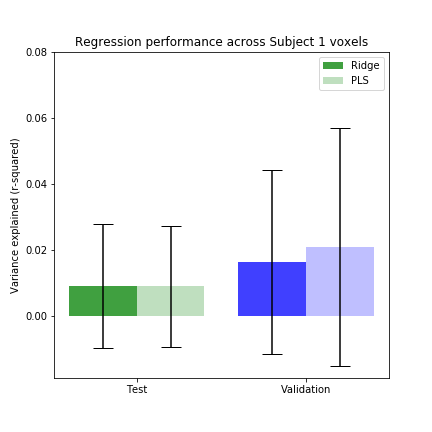
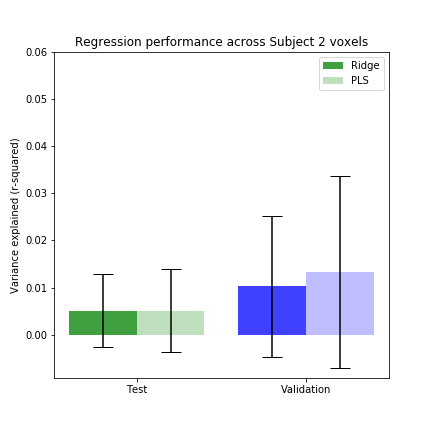
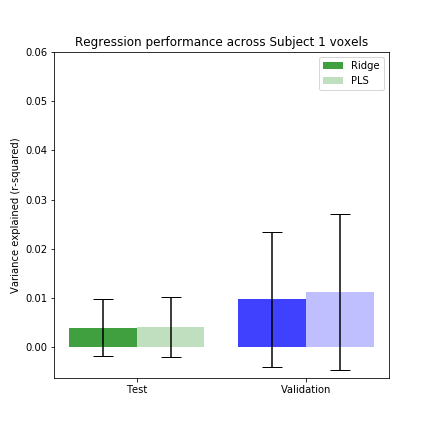
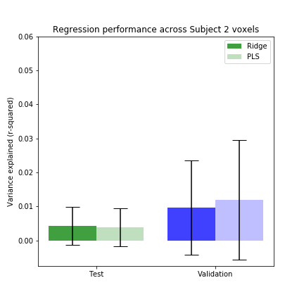
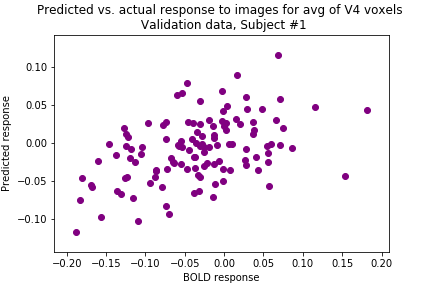

# CS431 Final Project
## Mapping from a deep convolutional neural network to V4 voxels

This project attempts to find a mapping from a deep convolutional neural network to human fMRI V4 
responses to naturalistic stimuli. The natural images and fMRI data used come from Kay et al., 2008 
(available at https://crcns.org/data-sets/vc/vim-1/about-vim-1). This open dataset includes peak BOLD 
responses in two participants for each of 1,750 training and 120 validation images, with indices provided 
for the voxels corresponding to V4 (our region of interest). The CNN of choice for this project was AlexNet
trained on ImageNet, as the feature space of the output of the Conv-3 layer of this network has been shown to 
be a good predictor of V4 neural responses in macaques (Bashivan, Kar & DiCarlo, 2019). The model checkpoint 
for this project was provided by Eshed Margalit and not included in this repository due to size limitations. 
I also save the alexnet conv3 feature weights for the naturalistic stimuli as .h5 files to load in other 
notebooks and these are similarly not included due to size. 

The code for this project is divided into the following notebooks:
1. **data_explore.ipnyb** – beginning exploration of the Kay fMRI dataset
2. **alexnet/Alexnet_for_V4.ipynb** – runs the naturalistic stimuli through the pre-trained Alexnet, extracts and saves features from layer Conv3
3. **alexnet/Alexnet_for_V4_retinawarp.ipynb** – preprocesses the naturalistic stimuli using the retinawarp package from the DiCarlo lab (Bashivan, Kar & DiCarlo, 2019) which mimics the eccentricity-dependent sampling of the retina. These stimuli are then run through Alexnet and features extracted as in the previous notebook.
4. **fit_V4.ipynb** – tries to find a mapping from conv3 features to the V4 voxels using PLS and ridge regression
5. **fit_V4_retinawarp.ipynb** – same as above but using retinawarp outputs

### Results

My attempts to fit individual voxels produced fairly lackluster results, as you can see here for the two subjects. Test (250 images from the original 1750 image training set) and validation (120 image validation set) performance from two regression methods (PLS and ridge regression) are plotted below, with error bars across voxels.

I then preprocessed all the images with retinawarp and tried again. This made little difference.

While performance was pretty dismal for individual voxels, fits were much better for the average response across all V4 voxels. Below I've plotted predicted vs. actual responses on left out validation data for Subject 1, where the model achieved r-squared = 0.20.

### Conclusions
So far this attempt to fit individual human fMRI V4 voxel responses from CNN features using individual naturalistic stimuli as opposed to comparing category RSMs has not been particularly successful. However, while the initial goal of fitting individual voxels well was not realized, AlexNet conv3 feature weights did provide an okay mapping to the average of all V4 voxels (r-squared = 0.20 on the validation dataset). There are numerous potential explanations for this discrepancy and for the poor individual voxel fits which will need to be ruled out (including flaws in this specific implementation). One possible hindrance would be voxel reliability issues as noisy voxels would be difficult to fit. Unfortunately, although the subjects were shown repeats of the images, the provided BOLD response data is averaged across repeats so I was unable to estimate reliability. Once bugs and/or reliability issues are ruled out, we can then ask if Alexnet conv3 is simply not a good enough model for V4 voxels, despite its success with primate neural recordings. Future work should focus on testing different models of human V4, including those that are more explicitly optimized for comparison to the ventral stream, such as TNN or CorNet, as well as factorizing the spatial and feature dimensions of the candidate models. 

### Dependencies
- python 2.7+
- GPU with CUDA libraries installed to support tensorflow
- matplotlib, pymongo, numpy, h5py, scipy, sklearn, and os

### References
Bashivan, P., Kar, K., & DiCarlo, J. (2018). Neural population control via deep image synthesis. *bioRxiv*, 461525.
Kay, K. N., Naselaris, T., Prenger, R. J., & Gallant, J. L. (2008). Identifying natural images from human brain activity. *Nature*, 452(7185), 352.
